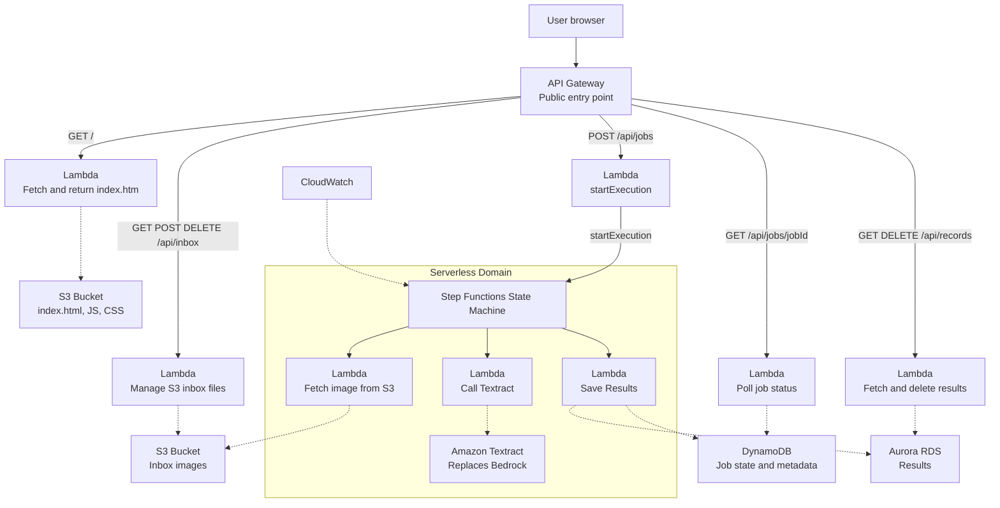

#Made by Mitchell Brown and Owen Ferko

#System Diagram

#AWS Pricing Calculator Quote

#Website Screenshot

#Side Note

This project demonstrates a minimum viable four tier AWS serverless architecture for image processing. The application lets a user upload an image, store it in an S3 inbox bucket, process the selected image through an AWS Step Functions workflow extract text with Amazon Textract, and display the extracted records in a web dashboard. The system was built with AWS SAM and Infrastructure as Code so the application can be validated, built, deployed, updated, and removed through repeatable CLI commands instead of manual console configuration. The project follows the required tiered architecture. The presentation tier is a React-based 'index.html' dashboard stored in an S3 frontend bucket and returned through the root API route. The API/compute tier uses API Gateway and Lambda functions for health checks, inbox management, job submission, job polling, and record management. The orchestration tier uses AWS Step Functions to coordinate the processing pipeline through 'L1Fetch', 'L2Call', and 'L3Save'. The persistence tier uses S3 for uploaded images, 'JobsTable' in DynamoDB for asynchronous job state, and 'RecordsTable' in DynamoDB for extracted text records. CloudWatch provides logging and monitoring evidence for the Lambda functions and Step Functions workflow. DevOps work was tracked through Azure DevOps user stories and implementation tasks. User stories acted as acceptance tests, while tasks represented the code changes needed to satisfy those tests. GitHub commits were linked to Devops work items using the 'AB#5' format to provide traceability between requirements and technical implementation. A Gherkin '.feature' file was added to document behavior driven development scenarios for uploading, processing, extracting, saving, and viewing records. This supports the required DevOps and BDD mapping by connecting requirements, implementation, and verification evidence. Security and compliance were addressed through AWS managed services, IAM roles, API Gateway routes, S3 buckets, DynamoDB tables, and CloudWatch logs. Uploaded files are not managed directly by users in the AWS console, instead the browser interacts with API Gateway and Lambda functions. Lambda functions control access to S3 and DynamoDB operations. The system avoids hard coded AWS credentials and relies on the SAM template to define roles, routes, tables, buckets, and functions. I also fixed an inbox deletion issue for filenames with spaces by decoding the URL path before deleting the S3 object, which improves reliability and correctness. For the Total Cost of Ownership, I used AWS Pricing Calculator to estimate the yearly cost of running this project. The estimate includes Amazon S3, Amazon API Gateway, AWS Lambda, AWS Step Functions, Amazon DynamoDB, Amazon Textract, and Amazon CloudWatch. The usage estimate assumes a small project workload with 1 GB of S3 storage, 5,000 API Gateway requests per month, 5,000 Lambda requests per month, 100 Step Functions workflow requests per month with 3 state transitions per workflow, 1 GB of DynamoDB storage, 100 Textract pages/images per month, and 1 GB of CloudWatch log ingestion. The AWS Pricing Calculator estimated the project at $5.93 per month and $71.16 for 12 months, with $0.00 upfront cost. The largest cost in the estimate is API Gateway at about $5.00 per month. The remaining are low due to architecture being mostly serverless and pay per use. This supports the cost optimization goal because the project does not require always running EC2 instances or a continuously running database server. The diagram below shows the full serverless workflow. The user enters through API Gateway, which routes requests to Lambda functions for the frontend, inbox actions, job submission, job polling, and record management. Uploaded images are stored in S3, Step Functions coordinates the Textract processing pipeline, DynamoDB stores job status and extracted records, and CloudWatch provides logging for debugging and monitoring.

________________________________________________________________________________________________

#System Diagram


________________________________________________________________________________________________

# DevOps Board Evidence

The Azure DevOps board was used to track the project user story, tasks, bugs, Gherkin work, and documentation work. GitHub commits were linked to Azure DevOps using the `AB#5` format.

> **Important Note:** Some Azure DevOps task dates/times may not perfectly match the original coding dates because several work items were updated after the implementation was already completed. Most commits are linked to Azure DevOps using `AB#5`. A small number of GitHub commits may not appear in the Development section because the `AB#5` tag was accidentally left out of those commit messages during the project.

## Populated Board


## User Story with Acceptance Criteria and GitHub Links


## GitHub Commits Linked with AB#5


## Closed Related Work Items


## Gherkin Files in GitHub


________________________________________________________________________________________________

## Gherkin Feature Files

[Mitchell Brown - Image Processing Feature](tests/Acceptance/Features/MB_ImageProcessing.feature)

[Owen Ferko - Project Evidence Feature](tests/Acceptance/Features/OF_ProjectEvidence.feature)
________________________________________________________________________________________________

# User Stories and Tasks

Task: Create SAM template and API Gateway

Task: Build health endpoint (GET /api/health)

Task: Build landing page route (GET /)

Task: Create frontend S3 bucket and upload index.html

Task: Create inbox S3 bucket

Task: Build inbox Lambda (GET /api/inbox)

Task: Add inbox upload (POST /api/inbox)

Task: Add inbox delete (DELETE /api/inbox/{key})

Task: Working Inbox Graphic Upload Button

Task: Process button

Task: Process_State_Machine

Task: Complete DynamoDB records workflow and final frontend/backend integration

1. GitHub commit link: https://github.com/Queen3K/CMSC_471/commit/a1a1850280ca941253b1b9276acb85b64248cd5e - Create SAM template and got working website

2. GitHub commit link: https://github.com/Queen3K/CMSC_471/commit/29fa86090b567a69c338361feb38f131c3f0c2a3 - Build inbox upload/delete

3. GitHub commit link: https://github.com/Queen3K/CMSC_471/commit/6569d6035631fcbd2ca808fd8965105931a77b50 - Add processing pipeline

4. GitHub commit link: https://github.com/Queen3K/CMSC_471/commit/f305c042de8db4a42d1b0687eb3b658d35aae74f - Add records workflow, and updated it to fix a issue

5. GitHub commit link: https://github.com/Queen3K/CMSC_471/commit/5e16c74bce25b516818cd7e3fa9b20a15df9c0d3 - Final debugging/fixes


________________________________________________________________________________________________

# Well Architected Questions and Answers


1. **How does the project enforce separation of concerns across tiers?**  
   The application uses a four-tier architecture. The presentation tier is the React-based `index.html` in S3, the API/compute tier uses API Gateway and Lambda, the orchestration tier uses Step Functions, and the persistence tier uses S3 and DynamoDB. Each tier handles its own responsibility.

2. **How does the project provide traceability between requirements and code?**  
   GitHub commits are linked to Azure DevOps work items using the `AB#5` format. User stories act as acceptance tests, and tasks represent the code changes that satisfy them.

3. **How does Behavior-Driven Development support verification?**  
   A Gherkin `.feature` file in `tests/Acceptance/Features/` documents BDD scenarios for uploading, processing, extracting, saving, and viewing records. This connects requirements, implementation, and verification evidence.

4. **How does the project follow the principle of least privilege?**  
   IAM roles defined in `template.yaml` grant each Lambda only the permissions it needs. For example, `LInbox` accesses the inbox S3 bucket, while `LRecords` accesses `RecordsTable`. No function has unrestricted account-wide access.

5. **How does Step Functions improve workflow visibility?**  
   Step Functions coordinates `L1Fetch`, `L2Call`, and `L3Save` as discrete states. Each state transition is recorded, so the execution history shows exactly where a job is in the pipeline and where any failure occurred.

6. **How does the system handle filenames containing special characters?**  
   The inbox delete handler URL-decodes the path key before issuing the S3 delete call. This fixed an earlier bug where files with spaces in the name could not be removed.

7. **How can the entire stack be recovered if it is lost or corrupted?**  
   Because the stack is fully defined in `template.yaml`, running `sam deploy` rebuilds every resource — buckets, tables, roles, routes, and functions — from source. No manual console reconfiguration is required.

8. **How does the architecture support scaling under increased load?**  
   All compute and storage services scale automatically. Lambda adds concurrent executions on demand, API Gateway absorbs request bursts, DynamoDB scales reads and writes per the table configuration, and S3 has effectively unlimited object storage.

9. **How is the cleanup process managed at end of life?**  
   The `aws cloudformation delete-stack` command removes the entire deployed stack in a single action. This avoids leaving behind orphaned buckets, tables, or Lambda functions that would continue to incur cost.

10. **How does the project produce evidence that the system actually works?**  
    Evidence is gathered from multiple sources: CloudWatch logs for Lambda and Step Functions runs, screenshots of the working website, GitHub commit history linked to DevOps tasks, and the Gherkin acceptance scenarios. Together these document that the system was built, tested, and reviewed.
    
________________________________________________________________________________________________

#AWS Pricing Calculator Quote

[Amazon Pricing.pdf](Amazon%20Pricing.pdf)

Summary:
- Upfront cost: $0.00
- Monthly estimate: $5.93
- 12-month estimate: $71.16
- Region: US East (N. Virginia)
- Services included: S3, API Gateway, Lambda, Step Functions, DynamoDB, Textract, and CloudWatch

________________________________________________________________________________________________

# Proof of Work Evidence

The project evidence is organized into folders based on the rubric categories.

## DevOps and BDD Evidence

| Evidence | File | What it proves |
|---|---|---|
| Populated Azure DevOps board | `DevOps BDD Evidence/devops-populated-board.png` | Shows the board contains project work items |
| User story with acceptance criteria and links | `DevOps BDD Evidence/devops-user-story-acceptance-criteria-and-links.png` | Shows the main user story, acceptance criteria, GitHub links, and related work |
| Closed related work items | `DevOps BDD Evidence/devops-closed-related-work-items.png` | Shows tasks and bugs marked Closed |
| GitHub commits linked with AB#5 | `DevOps BDD Evidence/devops-github-commits-linked-ab5.png` | Shows commit traceability through Azure DevOps |
| Individual task linked to GitHub commit | `DevOps BDD Evidence/devops-task-linked-github-commit.png` | Shows a task connected to a GitHub commit |
| Gherkin files in GitHub | `DevOps BDD Evidence/github-gherkin-files.png` | Shows each student’s `.feature` file |
| VS Code project structure | `DevOps BDD Evidence/vscode-project-structure-1.png` | Shows source folders, tests, README, template, and project files |

> **Important Note:** Some Azure DevOps task dates/times may not perfectly match the original coding dates because several work items were updated after the implementation was already completed. Most commits are linked to Azure DevOps using `AB#5`. A small number of GitHub commits may not appear in the Development section because the `AB#5` tag was accidentally left out of those commit messages during the project.

## SAM Commands and Infrastructure as Code Evidence

| Evidence | File | What it proves |
|---|---|---|
| SAM validate | `SAM commands working/sam-validate.png` | Shows the SAM template validates successfully |
| SAM build | `SAM commands working/sam-build.png` | Shows the project builds successfully |
| SAM deploy | `SAM commands working/sam-deploy.png` | Shows the stack deploys or is already up to date |
| CloudFormation resources | `SAM commands working/cloudformation-resources.png` | Shows AWS resources created from the template |
| CloudFormation outputs | `SAM commands working/cloudformation-outputs.png` | Shows stack outputs such as API and bucket information |

## AWS Architecture 4 Tiers Evidence

| Evidence | File | What it proves |
|---|---|---|
| Working website with records | `AWS Architecture 4 Tiers Evidence/working-website-records.png` | Shows the live app, Textract results, and Records panel |
| Infrastructure Composer diagram | `AWS Architecture 4 Tiers Evidence/infrastructure-composer.png` | Shows the deployed architecture visually |
| Step Functions executions | `AWS Architecture 4 Tiers Evidence/step-functions-executions.png` | Shows the state machine exists and has successful executions |
| Step Functions success graph | `AWS Architecture 4 Tiers Evidence/step-functions-success-graph.png` | Shows FetchImage → CallTextract → SaveResults completed |
| API Gateway routes | `AWS Architecture 4 Tiers Evidence/api-gateway-routes-terminal.png` | Shows deployed API Gateway routes |
| S3 buckets | `AWS Architecture 4 Tiers Evidence/s3-buckets.png` | Shows the frontend and inbox buckets |
| DynamoDB tables | `AWS Architecture 4 Tiers Evidence/dynamodb-tables.png` | Shows JobsTable and RecordsTable |
| DynamoDB records | `AWS Architecture 4 Tiers Evidence/dynamodb-records-table-items.png` | Shows extracted records saved in DynamoDB |
| CloudWatch log groups | `AWS Architecture 4 Tiers Evidence/cloudwatch-log-groups.png` | Shows logging resources exist |
| L2Call log streams | `AWS Architecture 4 Tiers Evidence/cloudwatch-l2call-logs.png` | Shows Textract Lambda log stream evidence |

## Security and Compliance Evidence

| Evidence | File | What it proves |
|---|---|---|
| Frontend bucket block public access | `Security Compliance Evidence/s3-frontend-block-public-access.png` | Shows frontend bucket blocks public access |
| Inbox bucket block public access | `Security Compliance Evidence/s3-inbox-block-public-access.png` | Shows inbox bucket blocks public access |
| Frontend bucket encryption | `Security Compliance Evidence/s3-frontend-encryption.png` | Shows default encryption enabled |
| Inbox bucket encryption | `Security Compliance Evidence/s3-inbox-encryption.png` | Shows default encryption enabled |
| IAM role in template.yaml | `Security Compliance Evidence/template-iam-role.png` | Shows LabRoleArn and `Role: !Ref LabRoleArn` |
| CloudWatch retention | `Security Compliance Evidence/cloudwatch-retention.png` | Shows `RetentionInDays: 7` |

## Commented template.yaml Evidence

| Evidence | File | What it proves |
|---|---|---|
| Commented SAM template | `template.yaml with comments/template-comments.png` | Shows major sections of `template.yaml` are commented |
| Template IAM role usage | `template.yaml with comments/template-iam-role.png` | Shows the LabRoleArn parameter and role reference |
| Template security settings | `template.yaml with comments/template-security-settings.png` | Shows S3 encryption, public access block, and secure transport policy |

________________________________________________________________________________________________

# Commented template.yaml
The submitted template.yaml includes comments explaining each major section, including:

API Gateway

Frontend S3 bucket

Inbox S3 bucket

Lambda functions

Step Functions state machine

JobsTable

RecordsTable

CloudWatch log groups

Outputs

________________________________________________________________________________________________

#Website Screenshot


Working website with processing working: 

________________________________________________________________________________________________

## Build and Deployment Commands

Validate the SAM template:

```powershell
sam validate
```

Build the SAM application:

```powershell
sam build --no-use-container
```

Deploy the backend stack:

```powershell
sam deploy --template-file .aws-sam/build/template.yaml --stack-name CMSCHelloStack --region us-east-1 --capabilities CAPABILITY_IAM --confirm-changeset --resolve-s3
```

Upload the frontend `index.html` file to the frontend S3 bucket:

```powershell
aws s3 cp .\wwwroot\index.html s3://cmschellostack-bucket-znndo108xbu0/index.html --region us-east-1
```

Delete the stack if cleanup is needed:

```powershell
aws cloudformation delete-stack --stack-name CMSCHelloStack --region us-east-1
```

________________________________________________________________________________________________

#Side Note

The src/proxy.py exist its just in health_service folder.