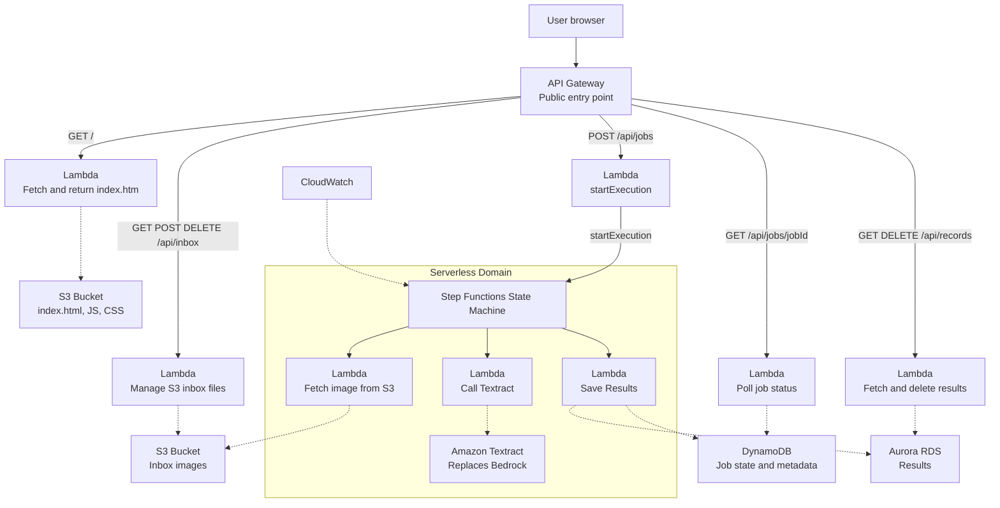

```mermaid
graph TD
    User[User browser] --> APIG[API Gateway<br/>Public entry point]

    APIG -->|GET /| LIndex[Lambda<br/>Fetch and return index.htm]
    APIG -->|GET POST DELETE /api/inbox| LInbox[Lambda<br/>Manage S3 inbox files]
    APIG -->|POST /api/jobs| LStart[Lambda<br/>startExecution]
    APIG -->|GET /api/jobs/jobId| LPoll[Lambda<br/>Poll job status]
    APIG -->|GET DELETE /api/records| LRecords[Lambda<br/>Fetch and delete results]

    LIndex -.-> S3Web[S3 Bucket<br/>index.html, JS, CSS]
    LInbox -.-> S3Store[S3 Bucket<br/>Inbox images]
    LStart -->|startExecution| SF

    LPoll -.-> DDB[DynamoDB<br/>Job state and metadata]
    LRecords -.-> Aurora[Aurora RDS<br/>Results]

    subgraph Serverless [Serverless Domain]
        SF[Step Functions State Machine]

        SF --> L1[Lambda<br/>Fetch image from S3]
        SF --> L2[Lambda<br/>Call Textract]
        SF --> L3[Lambda<br/>Save Results]

        L2 -.-> Text[Amazon Textract<br/>Replaces Bedrock]
    end
    L1 -.-> S3Store
    L3 -.-> Aurora
    L3 -.-> DDB

    CW[CloudWatch] -.-> SF
```