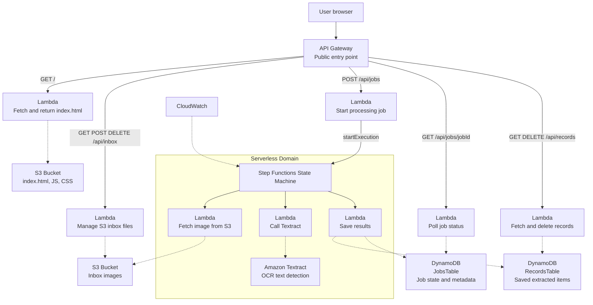
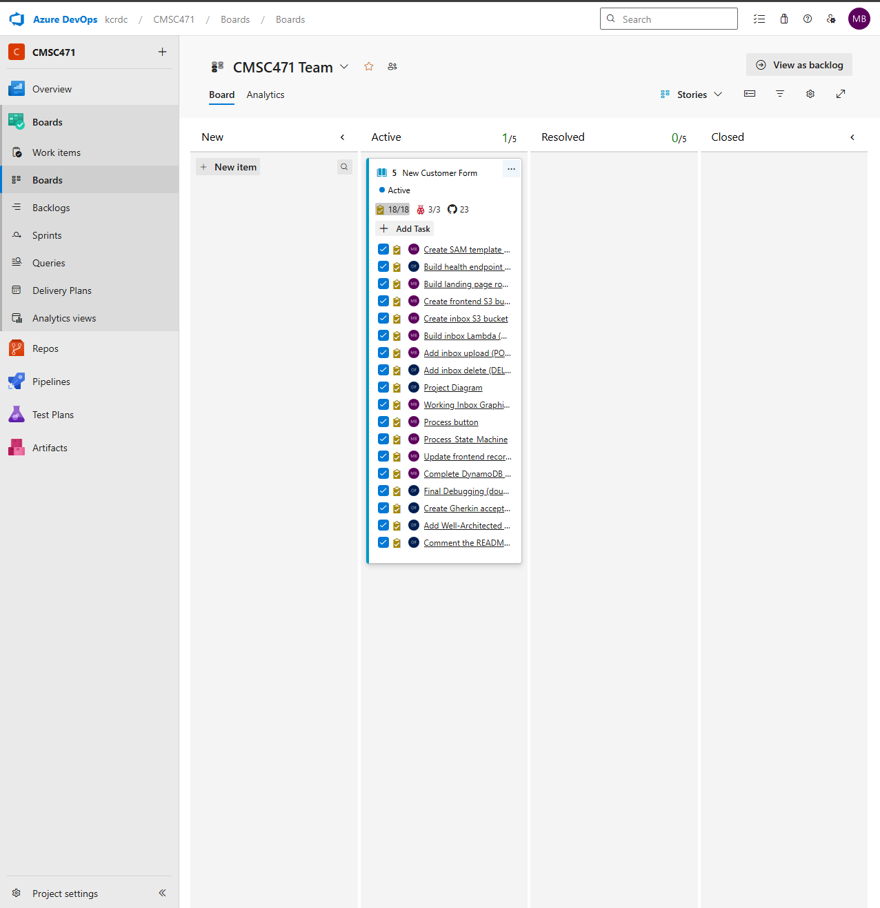
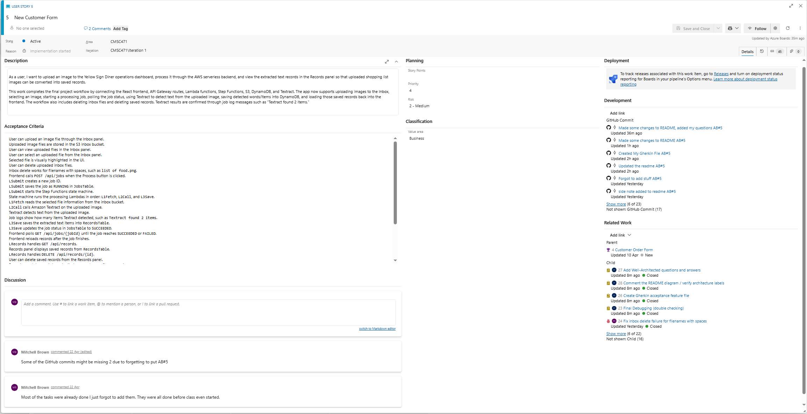
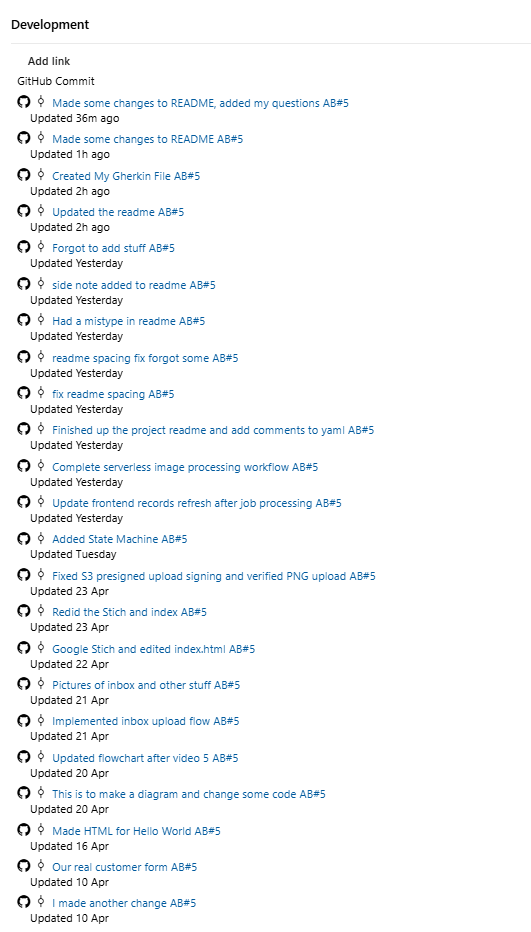
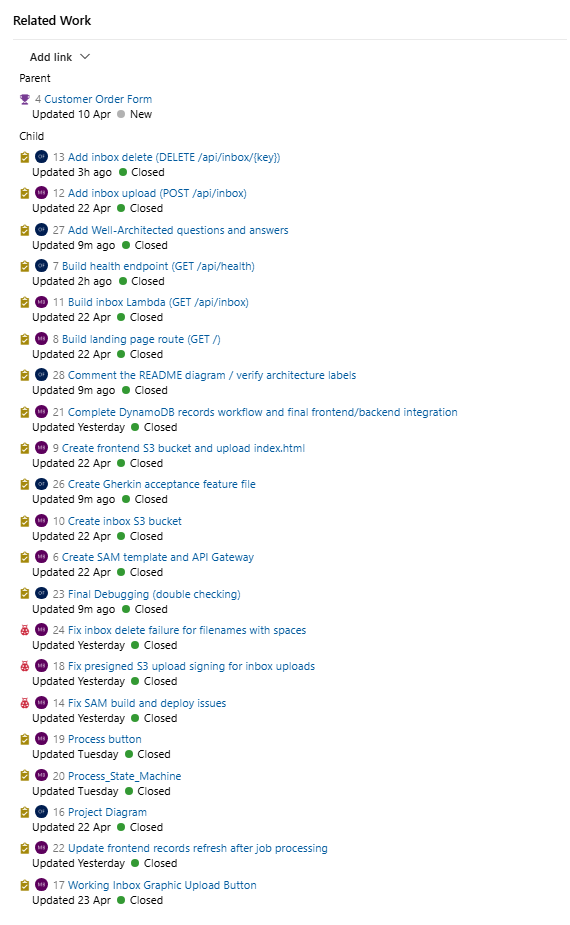
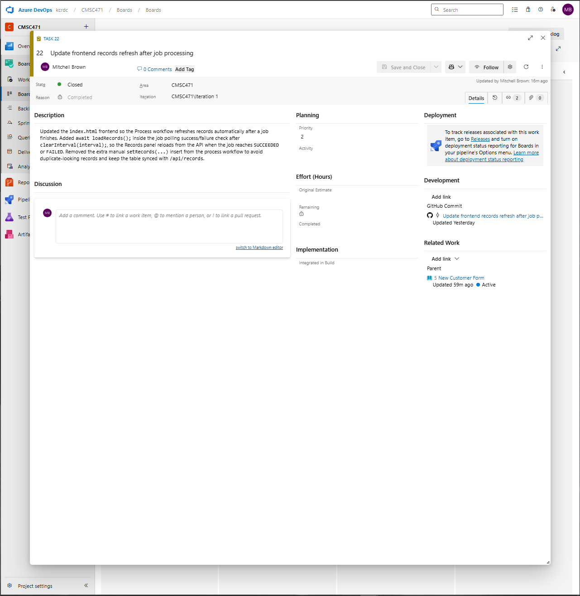
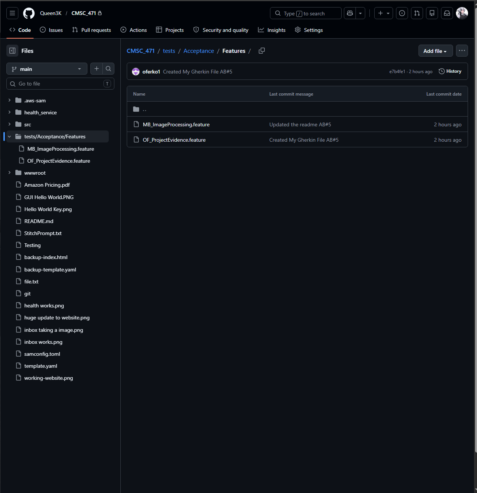
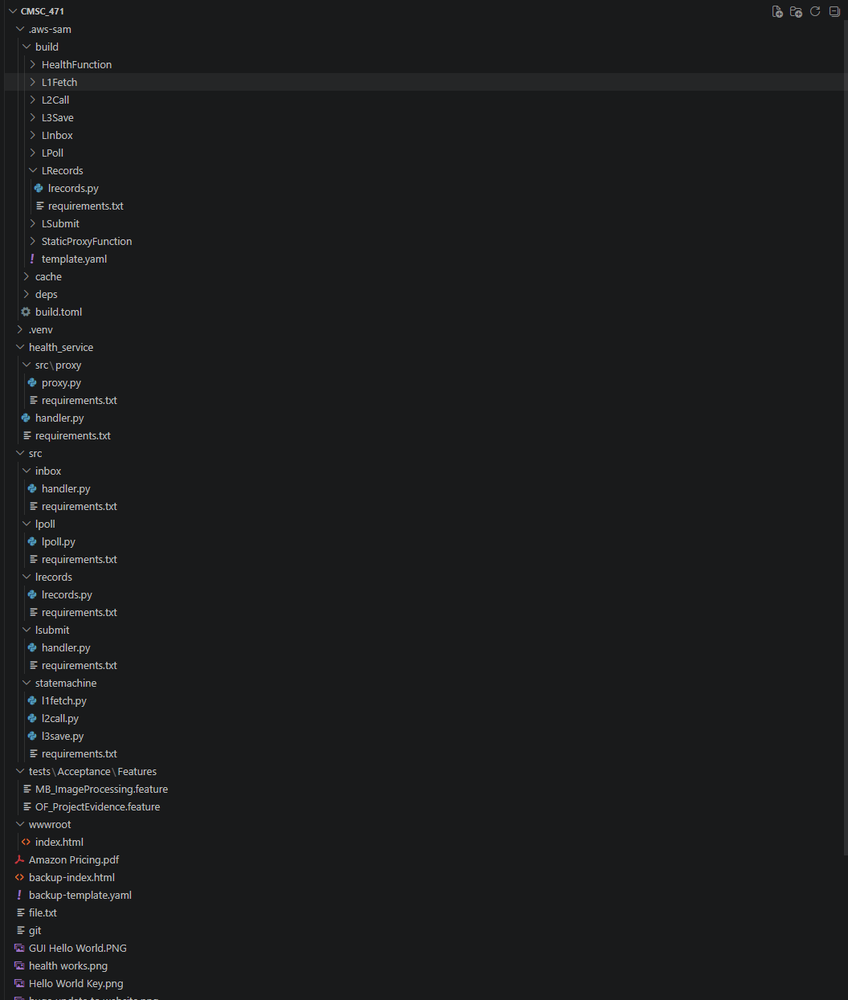
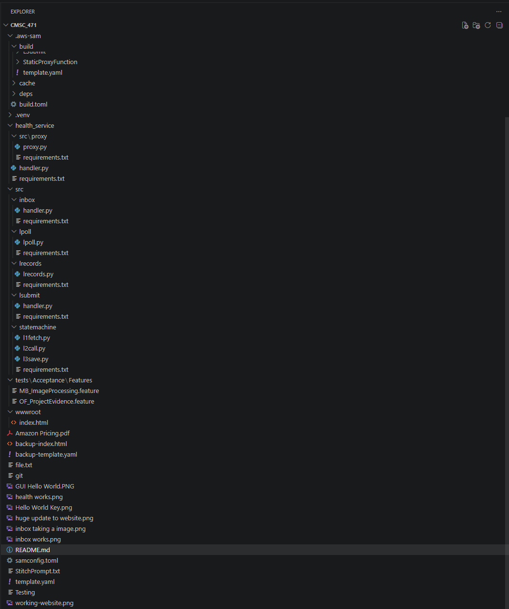
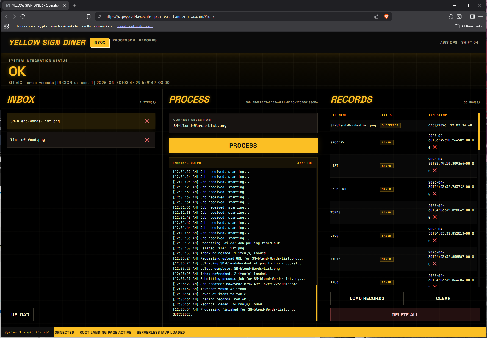

# CMSC 471 Final Project - Serverless Image Processing System

Made by Mitchell B and Owen Ferko

This project demonstrates a minimum viable four tier AWS serverless architecture for image processing. The application lets a user upload an image, store it in an S3 inbox bucket, process the selected image through an AWS Step Functions workflow, extract text with Amazon Textract, and display the extracted records in a web dashboard. The system was built with AWS SAM and Infrastructure as Code so the application can be validated, built, deployed, updated, and removed through repeatable CLI commands instead of manual console configuration. The project follows the required tiered architecture. The presentation tier is a React-based 'index.html' dashboard stored in an S3 frontend bucket and returned through the root API route. The API/compute tier uses API Gateway and Lambda functions for health checks, inbox management, job submission, job polling, and record management. The orchestration tier uses AWS Step Functions to coordinate the processing pipeline through 'L1Fetch', 'L2Call', and 'L3Save'. The persistence tier uses S3 for uploaded images, 'JobsTable' in DynamoDB for asynchronous job state, and 'RecordsTable' in DynamoDB for extracted text records. CloudWatch provides logging and monitoring evidence for the Lambda functions and Step Functions workflow. DevOps work was tracked through Azure DevOps user stories and implementation tasks. User stories acted as acceptance tests, while tasks represented the code changes needed to satisfy those tests. GitHub commits were linked to Devops work items using the 'AB#5' format to provide traceability between requirements and technical implementation. A Gherkin '.feature' file was added to document behavior driven development scenarios for uploading, processing, extracting, saving, and viewing records. This supports the required DevOps and BDD mapping by connecting requirements, implementation, and verification evidence. Security and compliance were addressed through AWS managed services, IAM roles, API Gateway routes, S3 buckets, DynamoDB tables, and CloudWatch logs. Uploaded files are not managed directly by users in the AWS console, instead the browser interacts with API Gateway and Lambda functions. Lambda functions control access to S3 and DynamoDB operations. The system avoids hard coded AWS credentials and relies on the SAM template to define roles, routes, tables, buckets, and functions. Because Learner Lab limited custom IAM policy changes, the project used the provided LabRole, but a production version should use least privilege IAM policies for each Lambda function. I also fixed an inbox deletion issue for filenames with spaces by decoding the URL path before deleting the S3 object, which improves reliability and correctness. The application can be recovered by redeploying the AWS SAM 'template.yaml' file which recreates the API Gateway routes, Lambda functions, S3 buckets, DynamoDB tables, Step Functions workflow, and CloudWatch log groups. Uploaded images are stored in S3, and extracted records stored in DynamoDB. A future production version should enable S3 versioning, S3 lifecycle policies, DynamoDB point in time recovery, and scheduled DynamoDB backups. If a Lambda function fails, CloudWatch logs and Step Functions execution history can be used to identify the failed stage and redeploy the corrected function through SAM. If the frontend is lost, 'index.html' can be reuploaded to frontend S3 Bucket. For the Total Cost of Ownership, I used AWS Pricing Calculator to estimate the yearly cost of running this project. The estimate includes Amazon S3, Amazon API Gateway, AWS Lambda, AWS Step Functions, Amazon DynamoDB, Amazon Textract, and Amazon CloudWatch. The usage estimate assumes a small project workload with 1 GB of S3 storage, 5,000 API Gateway requests per month, 5,000 Lambda requests per month, 100 Step Functions workflow requests per month with 3 state transitions per workflow, 1 GB of DynamoDB storage, 100 Textract pages/images per month, and 1 GB of CloudWatch log ingestion. The AWS Pricing Calculator estimated the project at **\$5.93 per month** and **\$71.16 for 12 months**, with **\$0.00 upfront cost**. The largest cost in the estimate is API Gateway at about **\$5.00 per month**. The remaining are low due to architecture being mostly serverless and pay per use. This supports the cost optimization goal because the project does not require always running EC2 instances or a continuously running database server. The diagram below shows the full serverless workflow. The user enters through API Gateway, which routes requests to Lambda functions for the frontend, inbox actions, job submission, job polling, and record management. Uploaded images are stored in S3, Step Functions coordinates the Textract processing pipeline, DynamoDB stores job status and extracted records, and CloudWatch provides logging for debugging and monitoring.

________________________________________________________________________________________________

#System Diagram



________________________________________________________________________________________________

# DevOps Board Evidence

The Azure DevOps board was used to track the user story, tasks, bugs, Gherkin work, and documentation work. GitHub commits were linked to Azure DevOps using the `AB#5` format.

**DevOps Note:** This project uses one main customer-facing User Story with implementation tasks underneath it. The instructor confirmed that tasks can count as the trackable User Story work for this project. Each task represents a specific feature, bug fix, or acceptance requirement, and GitHub commits were linked to Azure DevOps work items using `AB#5`.

**Important Note:** Some Azure DevOps task dates/times may not perfectly match the original coding dates because several work items were updated after the implementation was already completed. Most commits are linked to Azure DevOps using `AB#5`. Only 2 GitHub commits may not appear in the Development section because the `AB#5` tag was accidentally left out of those commit messages during the project.

## Populated Board



## User Story with Acceptance Criteria and GitHub Links



## GitHub Commits Linked with AB#5



## Closed Related Work Items



## Individual Task Linked to GitHub Commit



## Gherkin Files in GitHub



## VS Code Project Structure





________________________________________________________________________________________________

## Gherkin Feature Files

Each student contributed one Gherkin `.feature` file. These files document the BDD acceptance scenarios for the project.

- [Mitchell Brown - Image Processing Feature](tests/Acceptance/Features/MB_ImageProcessing.feature)
- [Owen Ferko - Project Evidence Feature](tests/Acceptance/Features/OF_ProjectEvidence.feature)

### Mitchell Brown Gherkin Feature

Feature: Yellow Sign Diner image processing workflow
  As a user of the Yellow Sign Diner dashboard
  I want to upload, process, and view text from images
  So that shopping list images can be converted into saved records

Scenario: Load the Yellow Sign Diner dashboard
  Given the AWS stack is deployed
  When the user opens the API Gateway root URL
  Then the Yellow Sign Diner dashboard should load
  And the page should show the Inbox, Process, and Records panels

Scenario: Upload an image to the inbox
  Given the Yellow Sign Diner dashboard is open
  When the user uploads a PNG or JPG image
  Then the frontend should request a presigned S3 upload URL
  And the image should be uploaded to the inbox S3 bucket
  And the image should appear in the Inbox panel

Scenario: Select an uploaded image
  Given uploaded files are displayed in the Inbox panel
  When the user clicks an inbox file
  Then the selected filename should be saved
  And the selected row should be highlighted
  And the Process panel should show the current selection

Scenario: Start an image processing job
  Given an uploaded image is selected
  When the user clicks the Process button
  Then the frontend should call POST /api/jobs
  And LSubmit should create a jobId
  And LSubmit should save the job as RUNNING in JobsTable
  And LSubmit should start the Step Functions state machine

Scenario: Run the Step Functions processing workflow
  Given a processing job has started
  When the Step Functions workflow runs
  Then the workflow should invoke L1Fetch
  And the workflow should invoke L2Call
  And the workflow should invoke L3Save

Scenario: Detect text with Amazon Textract
  Given L1Fetch returned the selected S3 image information
  When L2Call sends the image to Amazon Textract
  Then Textract should detect text from the uploaded image
  And the job log should report how many items were detected

Scenario: Save extracted records
  Given Textract returned detected text items
  When L3Save runs
  Then each detected item should be saved in RecordsTable
  And the job status should be updated to SUCCEEDED in JobsTable

Scenario: Reload records after processing
  Given the job reaches SUCCEEDED
  When the frontend stops polling the job
  Then the frontend should call loadRecords
  And the Records panel should display saved records from RecordsTable


### Owen Ferko Gherkin Feature


Feature: Final project evidence and records cleanup
  As a CMSC 471 project team member
  I want the project evidence, records workflow, and cleanup actions documented
  So that the final submission proves the system was built, tested, and reviewed

  Scenario: Verify Azure DevOps board is populated
    Given the CMSC 471 Azure DevOps project exists
    When the team views the board
    Then the board should show user stories, tasks, and bugs
    And at least five work items should be assigned to the student
    And completed work should be moved to Done

  Scenario: Verify GitHub commits are linked to DevOps tasks
    Given a DevOps task exists for a project change
    When the developer commits the change to GitHub
    Then the commit message should reference the Azure DevOps work item ID
    And the DevOps work item should show a link to the GitHub commit

  Scenario: Delete an inbox file without spaces
    Given an uploaded inbox file is named "food.png"
    When the user clicks the delete button for that file
    Then the frontend should call DELETE /api/inbox/{key}
    And the file should be removed from the S3 inbox bucket

  Scenario: Delete an inbox file with spaces
    Given an uploaded inbox file is named "list of food.png"
    When the user deletes the file
    Then the backend should decode the URL path key
    And the file should be removed from the S3 inbox bucket
    And GET /api/inbox should no longer return that file

  Scenario: Load saved records
    Given extracted records exist in RecordsTable
    When the frontend calls GET /api/records
    Then LRecords should scan RecordsTable
    And the Records panel should display the saved records

  Scenario: Delete a saved record
    Given a saved record exists in the Records panel
    When the user deletes the record
    Then the frontend should call DELETE /api/records/{id}
    And LRecords should delete the item from RecordsTable
    And the Records panel should reload without the deleted record

  Scenario: Verify AWS cost estimate is documented
    Given the AWS Pricing Calculator estimate has been created
    When the README cost section is reviewed
    Then it should include the monthly cost
    And it should include the 12 month cost
    And it should list the AWS services included in the estimate

  Scenario: Verify template.yaml is commented
    Given the SAM template exists in the repository
    When the reviewer opens template.yaml
    Then major sections should include comments
    And the comments should explain API Gateway, S3, Lambda, Step Functions, DynamoDB, CloudWatch, and outputs
________________________________________________________________________________________________

# User Stories and Tasks

Task: Create SAM template and API Gateway

Task: Build health endpoint (GET /api/health)

Task: Build landing page route (GET /)

Task: Create frontend S3 bucket and upload index.html

Task: Create inbox S3 bucket

Task: Build inbox Lambda (GET /api/inbox)

Task: Add inbox upload (POST /api/inbox)

Task: Add inbox delete (DELETE /api/inbox/{key})

Task: Working Inbox Graphic Upload Button

Task: Process button

Task: Process_State_Machine

Task: Complete DynamoDB records workflow and final frontend/backend integration

1. GitHub commit link: https://github.com/Queen3K/CMSC_471/commit/a1a1850280ca941253b1b9276acb85b64248cd5e - Create SAM template and got working website

2. GitHub commit link: https://github.com/Queen3K/CMSC_471/commit/29fa86090b567a69c338361feb38f131c3f0c2a3 - Build inbox upload/delete

3. GitHub commit link: https://github.com/Queen3K/CMSC_471/commit/6569d6035631fcbd2ca808fd8965105931a77b50 - Add processing pipeline

4. GitHub commit link: https://github.com/Queen3K/CMSC_471/commit/f305c042de8db4a42d1b0687eb3b658d35aae74f - Add records workflow, and updated it to fix a issue

5. GitHub commit link: https://github.com/Queen3K/CMSC_471/commit/5e16c74bce25b516818cd7e3fa9b20a15df9c0d3 - Final debugging/fixes


________________________________________________________________________________________________

# Well Architected Questions and Answers


### 1. Operational Excellence: How does the project support repeatable operations and troubleshooting?

**Mitchell Brown Answer:**  
The project uses AWS SAM and 'template.yaml' so the stack can be validated, built, deployed, and deleted from the command line. CloudWatch logs, Step Functions execution history, and frontend log messages help troubleshoot problems dueing image upload, processing, and record loading.

**Owen Ferko Answer:**  
The Azure DevOps board, GitHub commits, Gherkin files, and readme are evidence to create repeatable record of how systems was built and tested. Completed tasks and linked commits make it easier to understand what changed and why.

### 2. Security: How does the project control access to AWS resources?

**Mitchell Brown Answer:**  
The app uses API Gateway as the public entry point instead of exposing backend resources directly. Lambda functions use the Learner Lab IAM role from 'template.yaml', and no AWS credentials are hard coded in the source code.

**Owen Ferko Answer:**  
The S3 bucket use Block Public Access and default encryption. The project also includes bucket policies secure transport, and CloudWatch log retention limits how long logs are stored.

### 3. Reliability: How does the system handle failures or recovery?

**Mitchell Brown Answer:**  
Step Functions separates the workflow into 'L1Fetch', 'L2Call', and 'L3Save', making failures easier to identify. Job status is stored in 'JobsTable', so the frontend can poll for 'RUNNING', 'SUCCEEDED', or 'FAILED'.

**Owen Ferko Answer:**  
The project can be recovered by redeploying the SAM template. A production version should add S3 versioning, DynamoDB point in time recovery, and scheduled backups to protect uploaded images and extracted records.

### 4. Performance Efficiency: Why is this architecture efficient for this workload?

**Mitchell Brown Answer:**  
The system used serverless services that run only when needed. Lambda, API Gateway, S3, DynamoDB, Textract, and Step Functions are appropriate for a small image processing workload because they avoid always running servers.

**Owen Ferko Answer:**  
The frontend sends work to asynchronous backend processing instead of waiting for all processing in one request. Step Functions coordinates the work, and lastly DynamoDB provides fast reads for job status and saved records.

### 5. Cost Optimization: How does the project control cost?

**Mitchell Brown Answer:**  
The architecture is mostly par per use, so the app does not require always running EC2 instances or a continuously running database server. The AWS Pricing Calculator estimate was **\$5.93 per month** and **\$71.16 for 12 months**.

**Owen Ferko Answer:**  
The project manages the cost low by using small estimated workloads, limited CloudWatch retention, DynamoDB storage, and serverless compute. The largest estimated cost is API Gateway, while the other services remain low for the prototype workload.
    
________________________________________________________________________________________________

#AWS Pricing Calculator Quote

[Amazon Pricing.pdf](Amazon%20Pricing.pdf)


Summary:
- Upfront cost: $0.00
- Monthly estimate: $5.93
- 12-month estimate: $71.16
- Region: US East (N. Virginia)
- Services included: S3, API Gateway, Lambda, Step Functions, DynamoDB, Textract, and CloudWatch

________________________________________________________________________________________________

# Proof of Work Evidence

The project evidence is organized into folders based on the rubric categories. Each image below shows the proof used for the final project portfolio.


## DevOps and BDD Evidence


### Populated Azure DevOps Board


**What it proves:** Shows the Azure DevOps board contains project work items, including user stories, tasks, bugs, and completed project work.


---

### User Story with Acceptance Criteria and GitHub Links

**What it proves:** Shows the main user story, acceptance criteria, related tasks/bugs, and GitHub commit traceability.


---

### GitHub Commits Linked with AB#5

**What it proves:** Shows GitHub commits linked to Azure DevOps using the `AB#5` format.


---

### Closed Related Work Items

**What it proves:** Shows tasks and bugs marked Closed, proving implementation work was completed.


---

### Individual Task Linked to GitHub Commit

**What it proves:** Shows an individual DevOps task connected to a GitHub commit in the Development section.


---

### Gherkin Files in GitHub

**What it proves:** Shows both student Gherkin feature files checked into the GitHub repository.


---

### VS Code Project Structure

**What it proves:** Shows the local project structure with source folders, tests, Lambda folders, README, template, and project files.


---

## SAM Commands and Infrastructure as Code Evidence

### SAM Validate

**What it proves:** Shows the SAM template validates successfully.


---

### SAM Build

**What it proves:** Shows the SAM project builds successfully.


---

### SAM Deploy

**What it proves:** Shows the AWS stack deploys successfully or is already up to date.


---

### Frontend Upload Command

**What it proves:** Shows the frontend `index.html` file was uploaded to the S3 website bucket.


---

### CloudFormation Stack Resources

**What it proves:** Shows the AWS resources created by the SAM/CloudFormation stack.


---

### CloudFormation Stack Outputs

**What it proves:** Shows stack outputs such as deployed API and bucket information.


---

## AWS Architecture 4 Tiers Evidence

### Working Website Screenshot

**What it proves:** Shows the deployed Yellow Sign Diner web app working with Inbox, Process, Records, Textract output, and saved records.


---

### Infrastructure Composer Diagram

**What it proves:** Shows the visual AWS architecture with API Gateway, Lambda, S3, Step Functions, DynamoDB, and related resources.


---

### Step Functions Workflow

**What it proves:** Shows the orchestration tier where Step Functions successfully runs `FetchImage`, `CallTextract`, and `SaveResults`.


---

### API Gateway Routes

**What it proves:** Shows the deployed API Gateway routes used by the frontend.


---

### S3 Buckets

**What it proves:** Shows the frontend bucket and inbox bucket used by the application.


---

### DynamoDB Tables

**What it proves:** Shows DynamoDB tables used for job status and saved records.


---

### CloudWatch Logs

**What it proves:** Shows CloudWatch log groups and Lambda log stream evidence for monitoring and troubleshooting.


---

## Security Compliance Evidence

### S3 Block Public Access

**What it proves:** Shows both S3 buckets block public access.


---

### S3 Encryption

**What it proves:** Shows both S3 buckets use default server-side encryption.


---

### IAM Role in template.yaml

**What it proves:** Shows `LabRoleArn` and `Role: !Ref LabRoleArn`, proving IAM role usage is configured through the SAM template instead of hard-coded credentials.


---

### CloudWatch Retention

**What it proves:** Shows CloudWatch log retention is configured with `RetentionInDays: 7`.


---

### API Gateway as Controlled Entry Point

**What it proves:** Shows the application uses API Gateway as the controlled entry point instead of exposing backend AWS resources directly.


---

## Commented template.yaml Evidence

### Commented template.yaml

**What it proves:** Shows the SAM template has comments explaining major resource sections.


________________________________________________________________________________________________

# Commented template.yaml

@import "./template.yaml"

The submitted template.yaml includes comments explaining each major section, including:

API Gateway

Frontend S3 bucket

Inbox S3 bucket

Lambda functions

Step Functions state machine

JobsTable

RecordsTable

CloudWatch log groups

Outputs

________________________________________________________________________________________________

#Website Screenshot


Working website with processing working: 

________________________________________________________________________________________________

## Build and Deployment Commands

Validate the SAM template:

```powershell
sam validate
```

Build the SAM application:

```powershell
sam build --no-use-container
```

Deploy the backend stack:

```powershell
sam deploy --template-file .aws-sam/build/template.yaml --stack-name CMSCHelloStack --region us-east-1 --capabilities CAPABILITY_IAM --confirm-changeset --resolve-s3
```

Upload the frontend `index.html` file to the frontend S3 bucket:

```powershell
aws s3 cp .\wwwroot\index.html s3://cmschellostack-bucket-znndo108xbu0/index.html --region us-east-1
```

Delete the stack if cleanup is needed:

```powershell
aws cloudformation delete-stack --stack-name CMSCHelloStack --region us-east-1
```

________________________________________________________________________________________________

#Side Note

The src/proxy.py exist its just in health_service folder.
