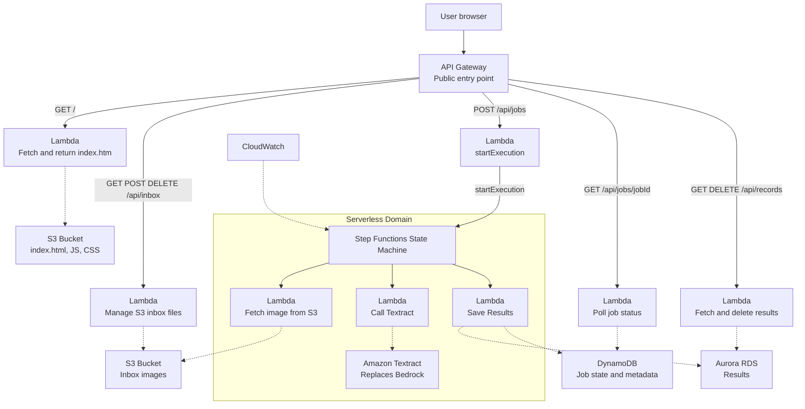

#Made by Mitchell Brown and Owen Ferko

#Serverless image processing system, this is what the system does, Architecture description, AWS cost estimate

This project demonstrates a minimum viable four tier AWS serverless architecture for image processing. The application lets a user upload an image, store it in an S3 inbox bucket, process the selected image through an AWS Step Functions workflow extract text with Amazon Textract, and display the extracted records in a web dashboard. The system was built with AWS SAM and Infrastructure as Code so the application can be validated, built, deployed, updated, and removed through repeatable CLI commands instead of manual console configuration. The project follows the required tiered architecture. The presentation tier is a React-based 'index.html' dashboard stored in an S3 frontend bucket and returned through the root API route. The API/compute tier uses API Gateway and Lambda functions for health checks, inbox management, job submission, job polling, and record management. The orchestration tier uses AWS Step Functions to coordinate the processing pipeline through 'L1Fetch', 'L2Call', and 'L3Save'. The persistence tier uses S3 for uploaded images, 'JobsTable' in DynamoDB for asynchronous job state, and 'RecordsTable' in DynamoDB for extracted text records. CloudWatch provides logging and monitoring evidence for the Lambda functions and Step Functions workflow. DevOps work was tracked through Azure DevOps user stories and implementation tasks. User stories acted as acceptance tests, while tasks represented the code changes needed to satisfy those tests. GitHub commits were linked to Devops work items using the 'AB#5' format to provide traceability between requirements and technical implementation. A Gherkin '.feature' file was added to document behavior driven development scenarios for uploading, processing, extracting, saving, and viewing records. This supports the required DevOps and BDD mapping by connecting requirements, implementation, and verification evidence. Security and compliance were addressed through AWS managed services, IAM roles, API Gateway routes, S3 buckets, DynamoDB tables, and CloudWatch logs. Uploaded files are not managed directly by users in the AWS console, instead the browser interacts with API Gateway and Lambda functions. Lambda functions control access to S3 and DynamoDB operations. The system avoids hard coded AWS credentials and relies on the SAM template to define roles, routes, tables, buckets, and functions. I also fixed an inbox deletion issue for filenames with spaces by decoding the URL path before deleting the S3 object, which improves reliability and correctness. For the Total Cost of Ownership, I used AWS Pricing Calculator to estimate the yearly cost of running this project. The estimate includes Amazon S3, Amazon API Gateway, AWS Lambda, AWS Step Functions, Amazon DynamoDB, Amazon Textract, and Amazon CloudWatch. The usage estimate assumes a small project workload with 1 GB of S3 storage, 5,000 API Gateway requests per month, 5,000 Lambda requests per month, 100 Step Functions workflow requests per month with 3 state transitions per workflow, 1 GB of DynamoDB storage, 100 Textract pages/images per month, and 1 GB of CloudWatch log ingestion. The AWS Pricing Calculator estimated the project at $5.93 per month and $71.16 for 12 months, with $0.00 upfront cost. The largest cost in the estimate is API Gateway at about $5.00 per month. The remaining are low due to architecture being mostly serverless and pay per use. This supports the cost optimization goal because the project does not require always running EC2 instances or a continuously running database server. The diagram below shows the full serverless workflow. The user enters through API Gateway, which routes requests to Lambda functions for the frontend, inbox actions, job submission, job polling, and record management. Uploaded images are stored in S3, Step Functions coordinates the Textract processing pipeline, DynamoDB stores job status and extracted records, and CloudWatch provides logging for debugging and monitoring.

________________________________________________________________________________________________

#System Diagram


________________________________________________________________________________________________

# DevOps Board Evidence


________________________________________________________________________________________________

## Gherkin Feature Files

[Mitchell Brown - Image Processing Feature](tests/Acceptance/Features/MB_ImageProcessing.feature)

[Owen Ferko - Project Evidence Feature](tests/Acceptance/Features/OF_ProjectEvidence.feature)
________________________________________________________________________________________________

# User Stories and Tasks

Task: Create SAM template and API Gateway

Task: Build health endpoint (GET /api/health)

Task: Build landing page route (GET /)

Task: Create frontend S3 bucket and upload index.html

Task: Create inbox S3 bucket

Task: Build inbox Lambda (GET /api/inbox)

Task: Add inbox upload (POST /api/inbox)

Task: Add inbox delete (DELETE /api/inbox/{key})

Task: Working Inbox Graphic Upload Button

Task: Process button

Task: Process_State_Machine

Task: Complete DynamoDB records workflow and final frontend/backend integration

1. GitHub commit link: https://github.com/Queen3K/CMSC_471/commit/a1a1850280ca941253b1b9276acb85b64248cd5e - Create SAM template and got working website

2. GitHub commit link: https://github.com/Queen3K/CMSC_471/commit/29fa86090b567a69c338361feb38f131c3f0c2a3 - Build inbox upload/delete

3. GitHub commit link: https://github.com/Queen3K/CMSC_471/commit/6569d6035631fcbd2ca808fd8965105931a77b50 - Add processing pipeline

4. GitHub commit link: https://github.com/Queen3K/CMSC_471/commit/f305c042de8db4a42d1b0687eb3b658d35aae74f - Add records workflow, and updated it to fix a issue

5. GitHub commit link: https://github.com/Queen3K/CMSC_471/commit/5e16c74bce25b516818cd7e3fa9b20a15df9c0d3 - Final debugging/fixes


________________________________________________________________________________________________

#Well Architected Questions and Answers


________________________________________________________________________________________________

#AWS Pricing Calculator Quote

[Amazon Pricing.pdf](Amazon%20Pricing.pdf)

Summary:
- Upfront cost: $0.00
- Monthly estimate: $5.93
- 12-month estimate: $71.16
- Region: US East (N. Virginia)
- Services included: S3, API Gateway, Lambda, Step Functions, DynamoDB, Textract, and CloudWatch

________________________________________________________________________________________________

# Proof of Work Evidence


________________________________________________________________________________________________

# Commented template.yaml
The submitted template.yaml includes comments explaining each major section, including:

API Gateway

Frontend S3 bucket

Inbox S3 bucket

Lambda functions

Step Functions state machine

JobsTable

RecordsTable

CloudWatch log groups

Outputs

________________________________________________________________________________________________

#Website Screenshot


Working website with processing working: 

________________________________________________________________________________________________

## Build and Deployment Commands

Validate the SAM template:

```powershell
sam validate
```

Build the SAM application:

```powershell
sam build --no-use-container
```

Deploy the backend stack:

```powershell
sam deploy --template-file .aws-sam/build/template.yaml --stack-name CMSCHelloStack --region us-east-1 --capabilities CAPABILITY_IAM --confirm-changeset --resolve-s3
```

Upload the frontend `index.html` file to the frontend S3 bucket:

```powershell
aws s3 cp .\wwwroot\index.html s3://cmschellostack-bucket-znndo108xbu0/index.html --region us-east-1
```

Delete the stack if cleanup is needed:

```powershell
aws cloudformation delete-stack --stack-name CMSCHelloStack --region us-east-1
```

________________________________________________________________________________________________

#Side Note

The src/proxy.py exist its just in health_service folder.