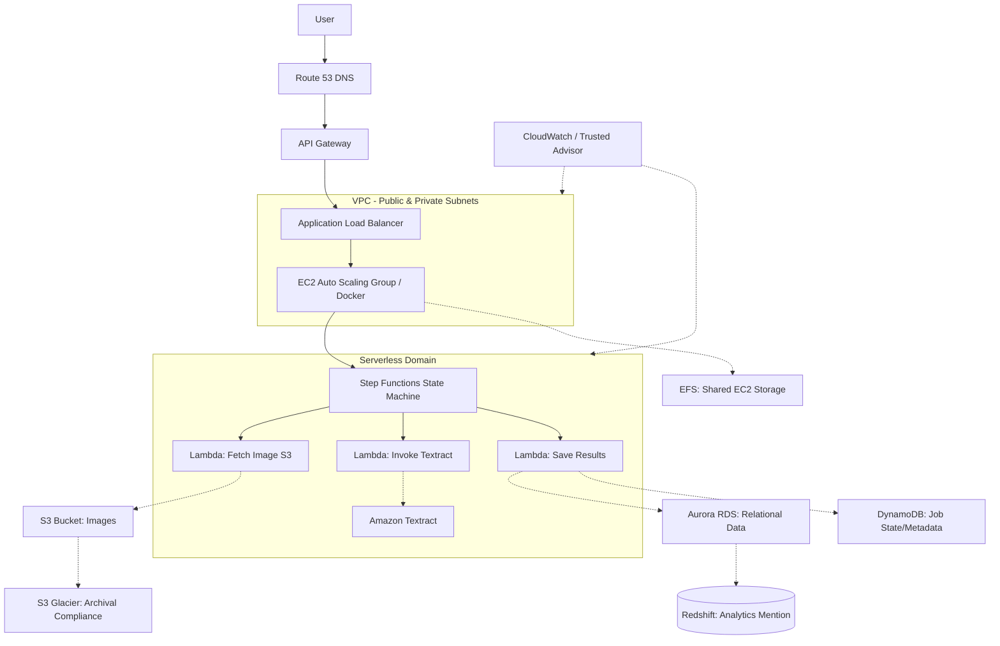

```mermaid
graph TD
    %% Edge & Network
    User[User] --> R53[Route 53 DNS]
    R53 --> AGW[API Gateway]
    AGW --> ALB[Application Load Balancer]

    %% Compute (Tier 2)
    subgraph VPC [VPC - Public & Private Subnets]
        ALB --> ASG[EC2 Auto Scaling Group / Docker]
    end

    %% Orchestration & Serverless (Tier 3)
    ASG --> SF[Step Functions State Machine]
    subgraph Serverless [Serverless Domain]
        SF --> L1[Lambda: Fetch Image S3]
        SF --> L2[Lambda: Invoke Textract]
        SF --> L3[Lambda: Save Results]
        L2 -.-> Textract[Amazon Textract]
    end

    %% Persistence (Tier 4)
    L1 -.-> S3Store[S3 Bucket: Images]
    S3Store -.-> Glacier[S3 Glacier: Archival Compliance]
    L3 -.-> Aurora[Aurora RDS: Relational Data]
    L3 -.-> DDB[DynamoDB: Job State/Metadata]
    
    %% Analytics & Storage concepts
    Aurora -.-> Redshift[(Redshift: Analytics Mention)]
    ASG -.-> EFS[EFS: Shared EC2 Storage]

    %% Monitoring
    CW[CloudWatch / Trusted Advisor] -.-> VPC
    CW -.-> Serverless
```